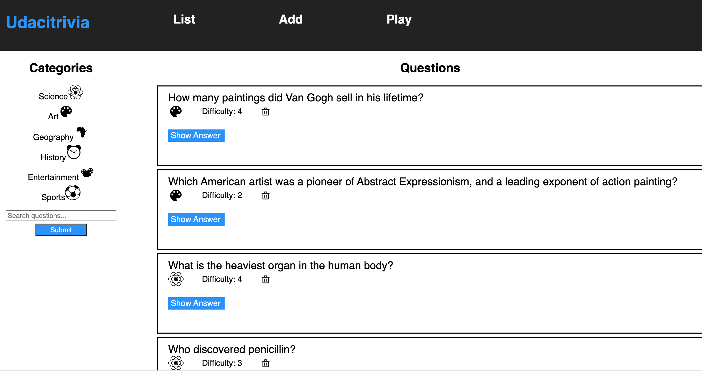
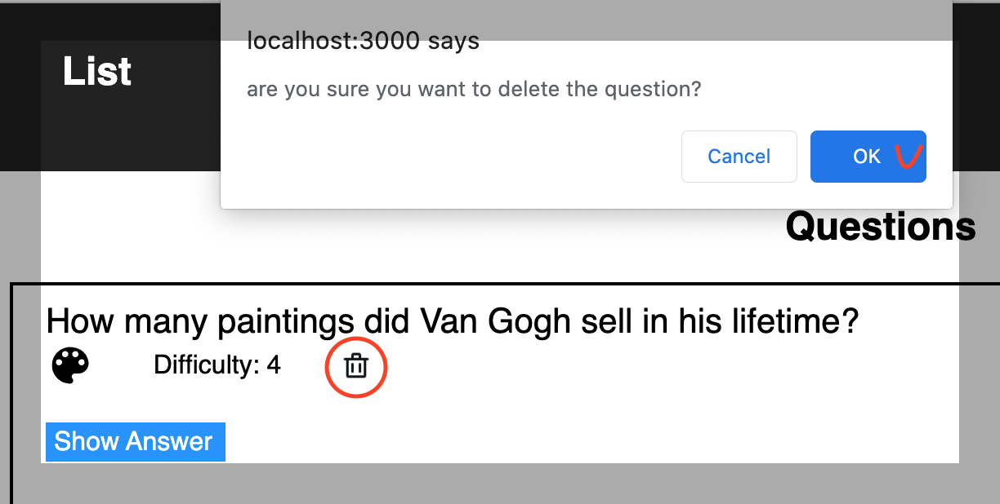
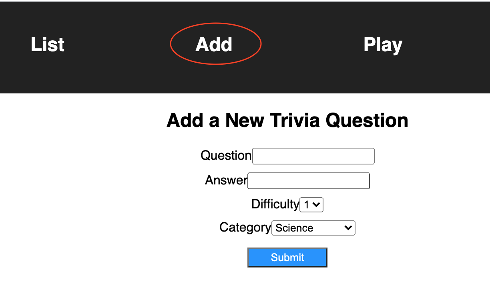
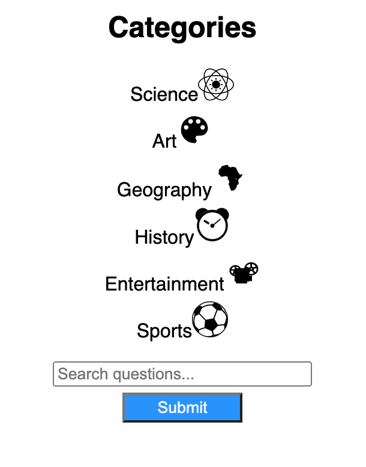
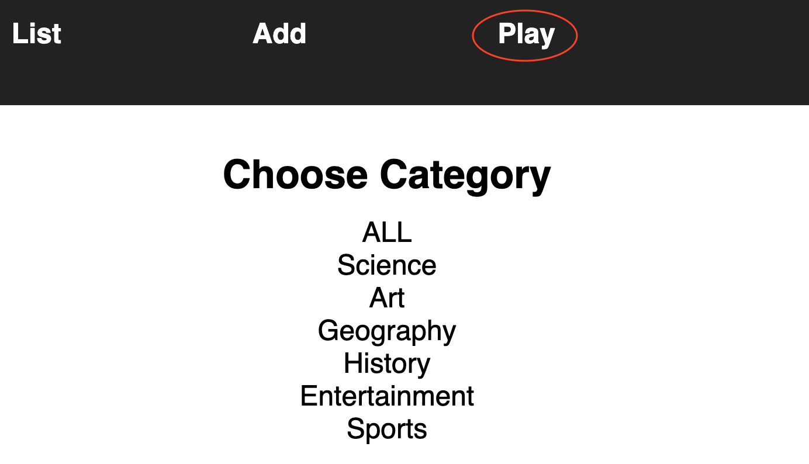

# Trivia game application "Udacitrivia"

## **Introduction**

Udacity is invested in creating bonding experiences for its employees and students. A bunch of team members got the idea to hold trivia on a regular basis and created a webpage to manage the trivia app and play the game.
At this game you should give answers to questions from several categories. For example, Science, Art, Geography, History, Entertainment, Sports.
 

 The application:

1. Displays questions - both all questions and by category. You can see the question, category, and difficulty rating by default and can show/hide the answer.


2. You can delete questions. Before deleting questions from database you should confirm this action.


3. You can add new questions. All created questions have to include questions and answers text.


4. You can search for questions by search term. And by clicking on the category


5. Play the quiz game, randomizing either all questions or within a specific category. 


Answer to questions and the application will count your score.
**Have fun!** 


## **Getting Started**

**Pre-requisites and Local Development**
Developers using this project should already have Python3, pip, and node installed on their local machines.

For detail setup directions read the READMEs in:

1. [`./frontend/`](./frontend/README.md)
2. [`./backend/`](./backend/README.md)

We recommend following the instructions in those files in order.


## **API**

## Getting Started

* Base URL: At present this app can only be run locally and is not hosted as base URL. The backend upp is hosted at the default, `http://127.0.0.1:5000/`, which is set as a proxi in the frontend configuration.
* Authentication: This version of the application does not require authentication or API keys.

## Error handling
Errors are returned as JSON objects in the following format:
`{
"success": False,
"error": 404,
"message": "resource not found"
}`

The API will return three error types when requests fail:
* 400: Bes Request
* 404: Resouses not found
* 422: Not Processable

## Endpoints

* [GET '/categories'](#get-categories)
* [GET '/questions](#get-questions)
* [GET '/categories/&lt;int:category_id&gt;/questions'](#get-categoriesintcategory_idquestions)
* [DELETE '/questions/&lt;int:question_id&gt;'](#delete-questionsintquestion_id)
* [POST '/questions/add'](#post-questionsadd)
* [POST '/questions'](#post-questions)
* [POST '/quizzes'](#post-quizzes)

### int_category

### GET '/categories'

* General:
    * Fetches a dictionary of categories in which the keys are the ids and the value is the corresponding string of the category
    * Request Arguments: None
    * Returns: Success value and an object with a single key, categories, that contains an object of id: category_string key:value pairs. 
* Sample: `curl http:/127.0.0.1:5000/categories`

```
"categories": {
"1": "Science", 
"2": "Art", 
"3": "Geography", 
"4": "History", 
"5": "Entertainment", 
"6": "Sports"
}, 
"success": true
```

### GET '/questions'
* General:
    * Fetches a list of question objects. The result is paginated in a group of 10. Include a request argument to choose page number, starting from 1. 
    * Request Arguments: None
    * Returns: Success value, a list of question objects, an object with a single key, categories, that contains an object of id: category_string key:value pairs, current category and the total number of questions
* Sample: `curl http:/127.0.0.1:5000/questions`
```
"categories": {
"1": "Science", 
"2": "Art", 
"3": "Geography", 
"4": "History", 
"5": "Entertainment", 
"6": "Sports"
}, 
"current_category": null, 
"questions": [
{
  "answer": "Maya Angelou", 
  "category": "4", 
  "difficulty": 2, 
  "id": 5, 
  "question": "Whose autobiography is entitled 'I Know Why the Caged Bird Sings'?"
}, 
{
  "answer": "Muhammad Ali", 
  "category": "4", 
  "difficulty": 1, 
  "id": 9, 
  "question": "What boxer's original name is Cassius Clay?"
}, 
{
  "answer": "Tom Cruise", 
  "category": "5", 
  "difficulty": 4, 
  "id": 4, 
  "question": "What actor did author Anne Rice first denounce, then praise in the role of her beloved Lestat?"
}, 
{
  "answer": "Edward Scissorhands", 
  "category": "5", 
  "difficulty": 3, 
  "id": 6, 
  "question": "What was the title of the 1990 fantasy directed by Tim Burton about a young man with multi-bladed appendages?"
}, 
{
  "answer": "Uruguay", 
  "category": "6", 
  "difficulty": 4, 
  "id": 11, 
  "question": "Which country won the first ever soccer World Cup in 1930?"
}, 
{
  "answer": "George Washington Carver", 
  "category": "4", 
  "difficulty": 2, 
  "id": 12, 
  "question": "Who invented Peanut Butter?"
}, 
{
  "answer": "Lake Victoria", 
  "category": "3", 
  "difficulty": 2, 
  "id": 13, 
  "question": "What is the largest lake in Africa?"
}, 
{
  "answer": "The Palace of Versailles", 
  "category": "3", 
  "difficulty": 3, 
  "id": 14, 
  "question": "In which royal palace would you find the Hall of Mirrors?"
}, 
{
  "answer": "Agra", 
  "category": "3", 
  "difficulty": 2, 
  "id": 15, 
  "question": "The Taj Mahal is located in which Indian city?"
}, 
{
  "answer": "Escher", 
  "category": "2", 
  "difficulty": 1, 
  "id": 16, 
  "question": "Which Dutch graphic artist\u2013initials M C was a creator of optical illusions?"
}
], 
"success": true, 
"total_questions": 19
```

### GET '/categories/<int:category_id>/questions'
* General:
  * Fetches a list of question objects based on a category. The result is paginated in a group of 10. Include a request argument to choose page number, starting from 1. 
  * Arguments: category_id
  * Returns: Success value, a list of question objects based on a current page number to update the front end, an object with a single key, categories, that contains an object of id: category_string key:value pairs, current category and the total number of questions.  
* Sample: `curl http:/127.0.0.1:5000/categories/3/questions`
`
```
"categories": {
"1": "Science", 
"2": "Art", 
"3": "Geography", 
"4": "History", 
"5": "Entertainment", 
"6": "Sports"
}, 
"current_category": null, 
"questions": [
{
  "answer": "Lake Victoria", 
  "category": "3", 
  "difficulty": 2, 
  "id": 13, 
  "question": "What is the largest lake in Africa?"
}, 
{
  "answer": "The Palace of Versailles", 
  "category": "3", 
  "difficulty": 3, 
  "id": 14, 
  "question": "In which royal palace would you find the Hall of Mirrors?"
}, 
{
  "answer": "Agra", 
  "category": "3", 
  "difficulty": 2, 
  "id": 15, 
  "question": "The Taj Mahal is located in which Indian city?"
}, 
{
  "answer": "11", 
  "category": "3", 
  "difficulty": 3, 
  "id": 27, 
  "question": "How many time zones are there in Russia? "
}, 
{
  "answer": "The Vatican", 
  "category": "3", 
  "difficulty": 2, 
  "id": 29, 
  "question": "What\u2019s the smallest country in the world? "
}
], 
"success": true, 
"total_questions": 5
```

### DELETE '/questions/<int:question_id>'
* General:
  * Deletes the question of the given ID if it exists.
  * Arguments: question_id
  * Returns: Success value, a list of question objects based on a current page number to update the front end, an object with a single key, categories, that contains an object of id: category_string key:value pairs, current category and the total number of questions.  
* Sample: `curl -X DELETE http:/127.0.0.1:5000/questions/5?page=1`
```
"categories": {
"1": "Science", 
"2": "Art", 
"3": "Geography", 
"4": "History", 
"5": "Entertainment", 
"6": "Sports"
}, 
"current_category": null, 
"questions": [
{
  "answer": "Tom Cruise", 
  "category": "5", 
  "difficulty": 4, 
  "id": 4, 
  "question": "What actor did author Anne Rice first denounce, then praise in the role of her beloved Lestat?"
}, 
{
  "answer": "Edward Scissorhands", 
  "category": "5", 
  "difficulty": 3, 
  "id": 6, 
  "question": "What was the title of the 1990 fantasy directed by Tim Burton about a young man with multi-bladed appendages?"
}, 
{
  "answer": "Muhammad Ali", 
  "category": "4", 
  "difficulty": 1, 
  "id": 9, 
  "question": "What boxer's original name is Cassius Clay?"
}, 
{
  "answer": "Uruguay", 
  "category": "6", 
  "difficulty": 4, 
  "id": 11, 
  "question": "Which country won the first ever soccer World Cup in 1930?"
}, 
{
  "answer": "George Washington Carver", 
  "category": "4", 
  "difficulty": 2, 
  "id": 12, 
  "question": "Who invented Peanut Butter?"
}, 
{
  "answer": "Lake Victoria", 
  "category": "3", 
  "difficulty": 2, 
  "id": 13, 
  "question": "What is the largest lake in Africa?"
}, 
{
  "answer": "The Palace of Versailles", 
  "category": "3", 
  "difficulty": 3, 
  "id": 14, 
  "question": "In which royal palace would you find the Hall of Mirrors?"
}, 
{
  "answer": "Agra", 
  "category": "3", 
  "difficulty": 2, 
  "id": 15, 
  "question": "The Taj Mahal is located in which Indian city?"
}, 
{
  "answer": "Escher", 
  "category": "2", 
  "difficulty": 1, 
  "id": 16, 
  "question": "Which Dutch graphic artist\u2013initials M C was a creator of optical illusions?"
}, 
{
  "answer": "Mona Lisa", 
  "category": "2", 
  "difficulty": 3, 
  "id": 17, 
  "question": "La Giaconda is better known as what?"
}
], 
"success": true, 
"total_questions": 18
```

### POST '/questions/add'
* General:
    * Creates a new question.
    * Request Arguments: question(string, text of new question), answer(string, answer to the question) difficulty(num, from 1 to 5), category(string, id of categiry)
    * Returns: Success value and the total number of questions.   
* Sample: `curl http:/127.0.0.1:5000/questions/add -X POST -H "Content-Type: application/json" -d '{"question": "How many stripes are there on the US flag?","answer": '13', "category": '4', "difficulty": 4}'`
```
"success": true, 
"total_questions": 18
```

### POST '/questions'
* General:
  * Fetches a list of question objects based on a search term. The result is paginated in a group of 10. Include a request argument to choose page number, starting from 1. 
  * Request Arguments: searchTerm(string)
  * Returns: Success value, a list of question objects based on the current page number to update the front end, an object with a single key, categories, that contains an object of id: category_string key:value pairs, current category and the total number of questions. 
* Sample: `curl http:/127.0.0.1:5000/questions -X POST -H "Content-Type: application/json" -d '{"searchTerm": "How"}'`
```
"categories": {
"1": "Science", 
"2": "Art", 
"3": "Geography", 
"4": "History", 
"5": "Entertainment", 
"6": "Sports"
}, 
"current_category": null, 
"questions": [
{
  "answer": "One", 
  "category": "2", 
  "difficulty": 4, 
  "id": 18, 
  "question": "How many paintings did Van Gogh sell in his lifetime?"
}, 
{
  "answer": "11", 
  "category": "3", 
  "difficulty": 3, 
  "id": 27, 
  "question": "How many time zones are there in Russia? "
}, 
{
  "answer": "13", 
  "category": "4", 
  "difficulty": 4, 
  "id": 28, 
  "question": "How many stripes are there on the US flag? "
}
], 
"success": true, 
"total_questions": 3
```

### POST '/quizzes'
* General:
  * Fetches a random questions object based on a category, or all categories to play the quiz
  * Request Arguments: previous_questions (list of questions IDs), quiz_category(object category {"type": (str), "id": (str)}) 
  * Returns: Success value and question is not one of the previous questions.  
* Sample: `curl http:/127.0.0.1:5000/quizzes -X POST -H "Content-Type: application/json" -d '{"previous_questions": [], "quiz_category": {"type": "Geography","id": "3"}}'`
```
"question": {
    "answer": "Agra", 
    "category": "3", 
    "difficulty": 2, 
    "id": 15, 
    "question": "The Taj Mahal is located in which Indian city?"
  }, 
  "success": true
```


## **Authors**
Udacity, Kotova Evgeniia

## **Acknowledgments**
The awesome team at Udacity for the idea of this application and for the knowledge that helps me to realize this game. 

